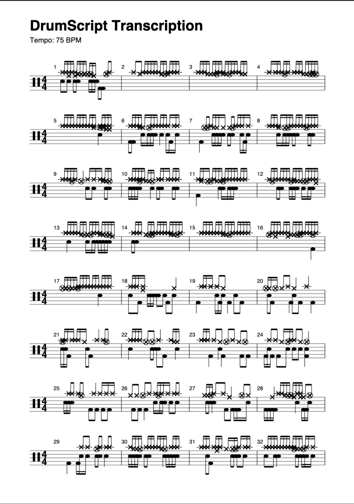

# **`DrumScript`**

<!--date_created: sun-15-june-2025-->
<!--date_edited: thurs-21-may-2026--->

**DrumScript** is an open-source Python library and CLI tool for drum audio analysis and transcription. Give it a recording — a full mix or an isolated drum stem — and it will generate PDF sheet music, MIDI files, and MusicXML output. The `DrumScript` model is a **deterministic classifier**, and doesn't use AI/machine learning. Built for drummers and by drummers, it is - and always will be - an open-source community tool.

> **Python >=3.9**

> **[Documentation](https://drumscript.github.io/DrumScript/)**

---


**Public Alpha (v0.1.4) — June to August 2026**

 - We're looking for early adopters and feedback — [try it out](https://colab.research.google.com/assets/colab-badge.svg)(https://colab.research.google.com/drive/1eDVXc3d6ezmorxINOjzldRPSC3emTl2), [report issues](https://github.com/DrumScript/DrumScript/issues), and help shape v1.0.
 - In particular we are interested in hearing from everyone:: drummers (coding not required!), sound engineers and academics in Music Information Retrieval with an interest in deterministic drum/percussion classifications. 
 - For beta release, we are planning to (amongst other things) improve the classification model, fix any user-suggested bugs, implement user-suggested feature requests and **most importantly** build a **WebGPU/ONNX/WASM UI** that will be free to use for all.

> See the [Roadmap](https://drumscript.github.io/DrumScript/guide/roadmap.html) for what's planned.

---

- **[Features](#features)**
- **[Installation](#installation)**
- **[Quick Start](#quick-start)**
- **[CLI Usage](#cli-usage)**
- **[Contributing](#contributing)**
- **[FAQs](#faqs)**

**Workflow Status**

[](https://github.com/DrumScript/DrumScript/actions/workflows/tests.yml)

**Demo Notebooks**

[](https://colab.research.google.com/drive/1eDVXc3d6ezmorxINOjzldRPSC3emTl2I)


### What it looks like

<!-- TODO: Replace with a GIF showing terminal output if you have one -->
<!-- For now, this shows the PDF transcription output -->

*Input: audio recording → Output: drum notation (PDF).




---

## Features

- **Automatic Drum Transcription:** Detects kicks, snares, hi-hats, toms, and cymbals using a deterministic, rule-based classification engine — no machine learning required.
- **Tempo Detection:** Automatically estimates BPM using a voting-system algorithm tuned for percussive audio.
- **Onset Detection:** Onset detection method tuned to the physics of percussion audio rather than polyphonic instruments (piano, guitar, etc.).
- **Stem Separation:** Uses the state-of-the-art [Demucs](https://github.com/adefossez/demucs) source separation model to isolate drums, bass, vocals, and other instruments from a full mix.
- **Backing Track Generator:** Automatically remove the drums from any `.mp3` or `.wav` to create a drumless play-along track. Bass-only and vocal-only extraction also supported.
- **Multiple Output Formats:** Export transcriptions to PDF sheet music, MIDI (`.mid`), and MusicXML (`.xml`) for import into DAWs and notation software (Logic Pro, Cubase, Ableton, MuseScore, Sibelius, etc.).
- **Deterministic Classification:** DrumScript's core classification engine uses physics-based rules derived from acoustic analysis of real drum samples, not probabilistic AI/ML models.

> **Note:** Some dependencies used by DrumScript (e.g. [Demucs](https://github.com/adefossez/demucs), [librosa](https://librosa.org/)) may internally use probabilistic methods. DrumScript's own classification engine is fully deterministic.

---

## Project Structure

See [`repository_structure.md`](repository_structure.md) for the full project layout.

```
DrumScript/
├── drumscript/                 # Main source package
│   ├── __init__.py             # Public API (transcribe, load_audio, etc.)
│   ├── main.py                 # CLI entry point
│   ├── audio_processor/        # Audio loading, DSP, stem splitting
│   ├── drum_classifier/        # Rule-based classification engine
│   ├── notation_generator/     # Score building, PDF/MIDI/XML export
│   └── utils/                  # Helpers (ffmpeg installer, research scripts)
├── docs/                       # Sphinx documentation
├── tests/                      # pytest test suite
├── .github/workflows/          # CI/CD (tests, build, publish, docs)
├── pyproject.toml              # Package metadata and dependencies
└── uv.lock                     # Pinned dependency versions
```


## Installation

**For users:**

```bash
pip install drumscript
```

**For developers:**

```bash
git clone https://github.com/DrumScript/DrumScript.git
cd DrumScript
uv sync # this will create a .venv
source .venv/bin/activate && uv sync --extra dev
pytest -m "not slow"
```

DrumScript manages all dependencies via [`pyproject.toml`](pyproject.toml) using [`uv`](https://docs.astral.sh/uv/). There is no `requirements.txt`.

### System dependencies

- **ffmpeg** is required for MP3 input/output. WAV-only workflows do not need it.
  - macOS: `brew install ffmpeg`
  - Ubuntu/Debian: `sudo apt-get install ffmpeg libsndfile1`
  - Windows: [Download from ffmpeg.org](https://ffmpeg.org/download.html) and add to PATH.
  - Or use the built-in helper: `import drumscript as ds; ds.install_ffmpeg()`

- **PortAudio** is required by `sounddevice` for audio playback.
  - macOS: `brew install portaudio`
  - Ubuntu/Debian: `sudo apt-get install libportaudio2`
  - Windows: Usually bundled with the `sounddevice` wheel.

---

## Quick Start

### End-to-end transcription

```python
import drumscript as ds

# Transcribe an isolated drum stem → PDF
pdf_path = ds.transcribe("drum_audio.wav")

# Transcribe a full song (separates drums automatically)
pdf_path = ds.transcribe("full_song.mp3", full_song=True)

# Get all intermediate results
result = ds.transcribe("drum_audio.wav", full=True)
print(f"Tempo: {result['tempo']:.1f} BPM")
print(f"Events: {len(result['events'])}")
```

### Load and explore audio

```python
import drumscript as ds

# Load at native sample rate (for notebooks / exploration)
audio_file = ds.load_audio("drum_audio.wav")
print(f"Sample rate: {sr} Hz, Duration: {len(audio)/sr:.1f}s")

# Detect tempo
bpm = ds.detect_tempo("drum_audio.wav")
print(f"Tempo: {bpm:.1f} BPM")
```

### Extract stems

```python
import drumscript as ds

# Extract just the drum stem
drum_path = ds.extract_stems("full_song.mp3")

# Create a drumless backing track in MP3
results = ds.extract_stems(
    "full_song.mp3",
    drumless=True,
    output_format="mp3",
    full=True,
)
print(f"Backing track: {results['mix']}")
```

---

## CLI Usage

DrumScript also provides a command-line interface.

### Basic transcription (isolated drum stem)

```bash
drumscript drum_audio.wav
```

### Full song transcription (auto-separates drums)

```bash
drumscript full_song.mp3 --full
```

### Extract a drumless backing track

```bash
drumscript full_song.mp3 --drumless
```

### All options

```bash
drumscript <audio_file> [OPTIONS]

Options:
  --full          Transcribe a full song (isolates drums first via Demucs)
  --drumless      Extract a drumless backing track
  --mute STEM     Mute a specific stem (e.g. --mute bass). Repeatable.
  --all-stems     Export all individual stems (drums, bass, vocals, other)
  --format FORMAT Output format for stems: wav (default) or mp3 (requires ffmpeg to be installed)
  --rudiment      Optimise classification for isolated single beats
  --ts SIG        Time signature (default: 4/4)
```

### Examples

```bash
# Transcribe with 6/8 time signature
drumscript drum_audio.wav --ts 6/8

# Extract all stems as MP3
drumscript full_song.mp3 --all-stems --format mp3

# Classify rudiments
drumscript snare_hit.wav --rudiment
```
---

## Contributing

We welcome contributions! DrumScript is intended to be a community-owned project.

- **[Open an Issue](https://github.com/DrumScript/DrumScript/issues/new)** for bugs or feature requests.
- **[Submit a Pull Request](https://github.com/DrumScript/DrumScript/pulls)** for code changes.
- See **[CONTRIBUTING.md](CONTRIBUTING.md)** for the full contributor guide.

> All bug reports and feature requests must be filed as GitHub Issues. All code changes must be submitted as Pull Requests. Keeping discussion public helps everyone.

**[hello.drumscript@gmail.com](mailto:hello.drumscript@gmail.com)**

## Alpha Priorities (v0.1 – v0.2) 
The alpha phase runs between 01 June and 31 August 2026

**What works today:**

- End-to-end transcription pipeline: audio → onsets → classification → PDF / MIDI / MusicXML
- Tempo detection via spectral onset envelope
- Stem separation using Demucs (`htdemucs` 4-stem model)
- Drumless backing track generation
- CLI and Python API

**What we're focused on during the alpha:**

- Expanding test coverage across genres, kit types, and recording conditions
- Fixing classification edge cases (deep snares vs clicky kicks, splash cymbals vs open hats)
- Improving onset detection sensitivity for ghost notes and fast passages
- Stabilising the public API ahead of the beta freeze
- Community feedback collection


---

## FAQs

### Why doesn't DrumScript include `ffmpeg` as a dependency?

ffmpeg is a system-level program, not a Python library, so it cannot be declared in `pyproject.toml`. It must be installed on the operating system. DrumScript provides an `install_ffmpeg()` helper to make this easier. 

### What normalisation is applied to loaded audio?

`load_audio()` applies **peak normalisation** after loading. It converts the audio to mono and scales it so the loudest sample is at 1.0. This is a linear operation — no audio detail is lost.

### What is `hop_length`?

When analysing audio, librosa slides a small analysis window across the signal. The `hop_length` is how many samples the window advances per step. DrumScript uses `HOP_LENGTH = 128`, which at 44100 Hz gives a time resolution of ~2.9 milliseconds — fast enough to capture individual drum hits.

### Does DrumScript use AI/machine learning?

DrumScript's own classification engine is **fully deterministic** — it uses physics-based rules, not neural networks. However, the optional stem separation feature uses [Demucs](https://github.com/adefossez/demucs), which is a deep learning model by Meta/Facebook.

---

## Acknowledgements

- **[Demucs](https://github.com/adefossez/demucs)** — The stem splitting functionality is built upon the work of [@adefossez](https://github.com/adefossez).
- **[librosa](https://librosa.org/)** — For foundational audio processing tools.

---

## License

[Apache License 2.0](LICENSE)

---

<!--END-->
