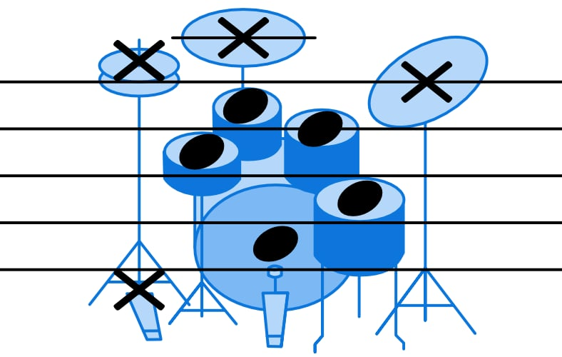
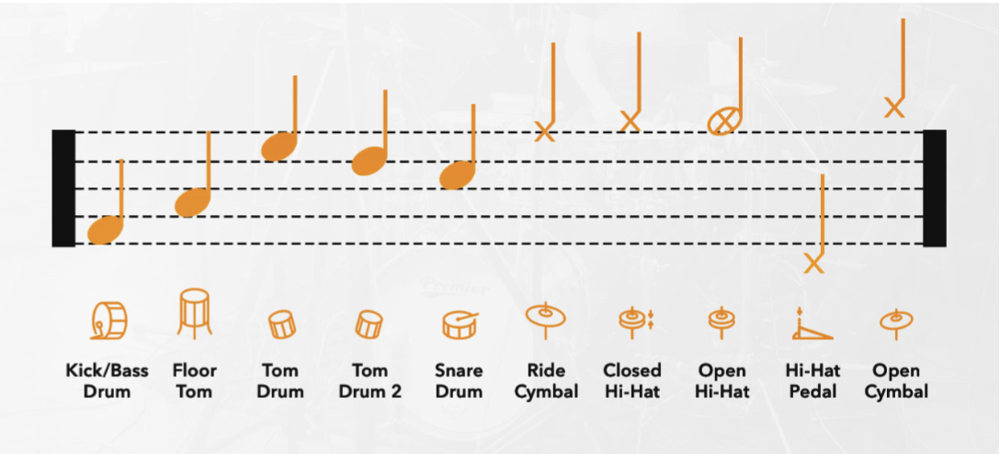
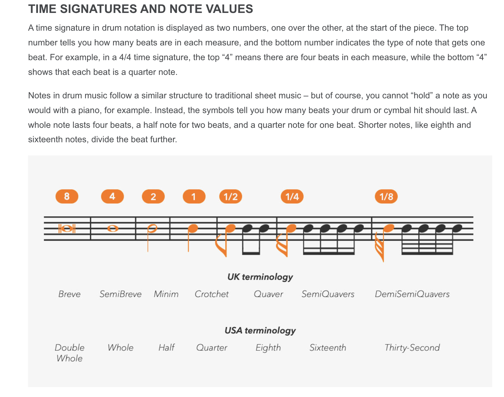
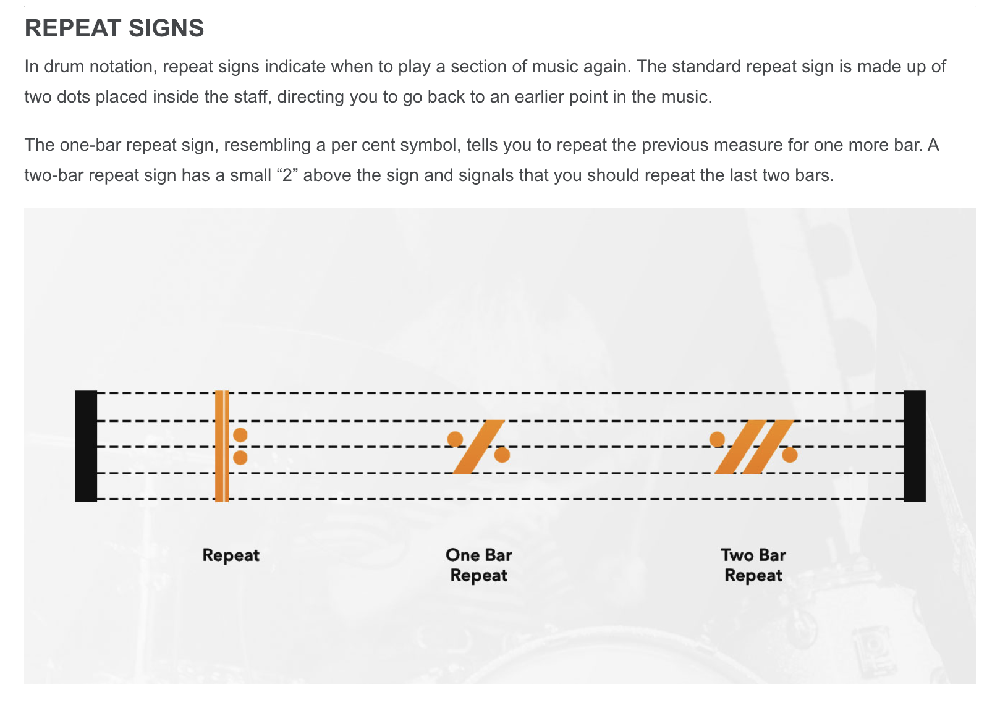

# How to Read Drum Notation

Drum notation is a variation of standard musical notation. Instead of pitch (C, D, E), the vertical position on the staff represents a specific part of the drum kit (`Snare`, `Kick`, `Hi-Hat`).

## The Drum Key
The "Legend" or "Key" tells you which drum corresponds to which note. While there are standards, they can vary slightly between publishers.

**Basic Notation Key:**

*Source: [School of Rock - Drum Notation for Beginners](https://www.schoolofrock.com/resources/drums/drum-notation-for-beginners)*

**Full Kit Visualisation:**

*Source: [Drumeo - How to Read Drum Music](https://www.drumeo.com/beat/how-to-read-drum-music/)*

## The Staff & Symbols
DrumScript uses a standard 5-line staff.
* **Drums (Shells):** Represented by standard round note heads (●).
* **Cymbals:** Represented by "X" note heads (x).

**Staff Layout:**

*Source: [Gear4music - How to Read Drum Music Notation](https://www.gear4music.com/blog/drum-music-notation/)*

Just like other instruments, rhythm is denoted by the note duration (Whole, Quarter, Eighth, Sixteenth).

**Rhythmic Values:**

*Source: [Gear4music - How to Read Drum Music Notation](https://www.gear4music.com/blog/drum-music-notation/)*

## Repeats and Structure
To save space, drum music often uses repeat signs.
* **% (One Bar Repeat):** Play the previous measure again.
* **Two Dots (||:  :||):** Repeat the enclosed section.

**Repeat Signs Guide:**

*Source: [Gear4music - How to Read Drum Music Notation](https://www.gear4music.com/blog/drum-music-notation/)*